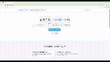

# つべのーと / YouTube 用メモ作成・共有サービス

YouTube 動画にメモを残し、内容を記録・共有できる Web アプリです。

🌐 https://tubenote.jp

---

## デモ

ログインから新規投稿までの一連の操作を確認できます。

---

## サービス概要

「つべのーと」は、YouTube で学んだ内容を、自分だけの **学習ノート** として手軽に記録・整理・共有できるサービスです。

YouTube を使用した学習時の「あとで見返したい」「メモをまとめて管理したい」という課題を解決することを目的としています。

---

## 開発背景

私は学習に YouTube をよく利用しています。近年は質の高い学習動画が数多く公開されており、
手軽に視聴できる点や、幅広い分野を学べる点が YouTube 学習の大きな強みだと感じています。

一方で、動画を見ながら学んだ内容をコメント欄にメモしているユーザーを目にすることがありました。
コメント欄のメモは、同じ動画を開かなければ振り返ることができず、
学習内容を体系的に管理しづらいという課題があります。
私自身も、気軽にメモをまとめて管理できる場所があれば便利だと感じていました。

そこで、動画ごとに学んだ内容を一つの場所で整理・管理できるサービスがあれば便利だと考え、
本サービスを開発しました。

さらに、メモを共有できる仕組みにすることで、
他のユーザーの理解や視点も参考にでき、学習の幅が広がると考えています。

---

## 主な機能

- ノートの投稿
- ノートの表示（動画ごと・投稿ごと）
- いいね機能
- ユーザー登録
- ログイン（Local / Google / GitHub）

---

## 使用技術

| Category                | Technology Stack              |
| ----------------------- | ----------------------------- |
| Frontend                | TypeScript, Next.js           |
| Backend                 | TypeScript, NestJS, Prisma    |
| Infrastructure          | AWS Lightsail, Nginx, PM2     |
| Database                | PostgreSQL                    |
| Development Environment | Docker（PostgreSQL のみ）     |
| CI/CD                   | GitHub Actions                |
| Design                  | Tailwind CSS                  |
| Others                  | ESLint, Prettier, Git, GitHub |

### 主要パッケージ

**Frontend**

- jose：JWT の生成・検証処理
- Resend：メール送信

**Backend**

- Passport：認証基盤
- JWT：トークン認証
- Google OAuth 2.0 / GitHub OAuth：外部認証
- bcrypt：パスワードのハッシュ化

---

## 工夫した点

単に機能を実装するだけでなく、実務での利用や運用を意識した設計を行いました。

- フロントエンドとバックエンドを分離し、それぞれの責務が明確になる構成にしています。
- 認証は JWT をベースに、Google・GitHub OAuth を組み合わせることで、将来的な拡張を意識した設計にしました。
- 可読性を重視し、読み手が理解しやすいコード構成を意識して実装しています。
- コンポーネント化を行い、保守性・再利用性を高めました。
- エラー発生時のケースを想定し、適切なレスポンスを返すエラーハンドリングを実装しています。

---

## 今後の展望

今後は以下の機能追加を予定しています。

- 投稿の公開・非公開設定
- 投稿の検索機能
- いいねした投稿の一覧表示
